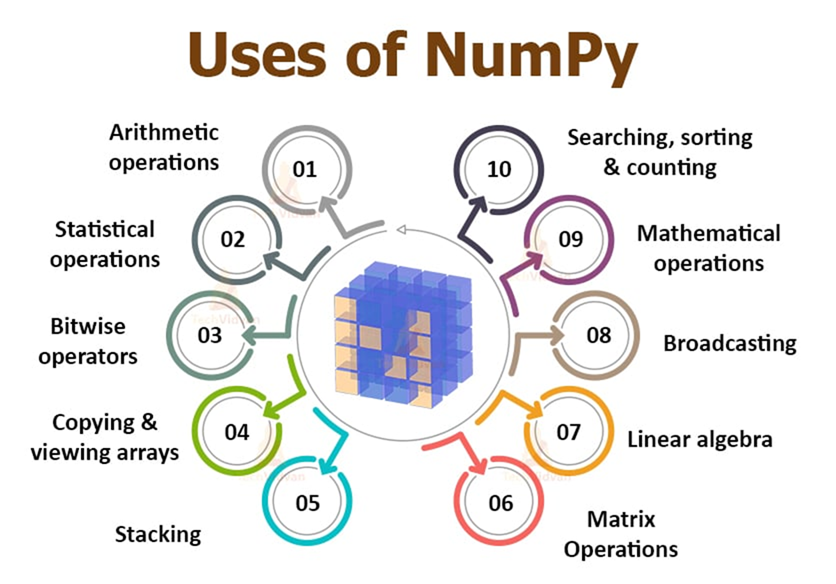

# Numpy

NumPy, short for Numerical Python, is a fundamental open-source library in Python for scientific
computing. It provides support for large, multi-dimensional arrays and matrices,
along with a collection of high-level mathematical functions to operate efficiently on these arrays._ 

## Use Case's
1. Importing NumPy → Loading the NumPy library (import numpy as np) to use its functions and arrays.
2. Creating Arrays → Building arrays from lists, tuples, or functions like np.array(), np.zeros(), np.arange().
3. Array Attributes → Properties like shape, size, dtype, ndim that describe an array.
4. Indexing & Slicing → Accessing or extracting specific elements or ranges from arrays.
5. Mathematical Operations → Performing element-wise arithmetic, trigonometric, and exponential operations.
6. Aggregate Functions → Functions like sum(), mean(), min(), max() to summarize array data.
7. Reshaping → Changing the shape of an array without altering its data (e.g., reshape()).
8. Stacking & Splitting → Combining multiple arrays (hstack, vstack) or dividing them into parts (split).
9. Random Module → Generating random numbers, sampling, and creating random arrays.
10. Linear Algebra → Matrix operations like dot product, determinant, eigenvalues (np.linalg).
11. Useful Functions → Handy tools like np.where(), np.unique(), np.sort(), np.linspace() for data handling.

