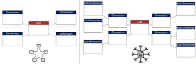
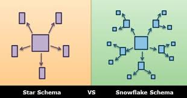

!

# --Star Schema

Definition: A schema where a central fact table is connected directly to multiple denormalized dimension tables.
Structure: Looks like a star — fact table in the center, dimensions radiating outward.
Dimension tables: Usually denormalized (store full descriptive data in a single table).
Performance: Faster query performance (less joins).
Storage: Requires more storage (duplicate data in dimensions).
Use case: Best for simple reporting & OLAP queries where speed is more important than storage efficiency.

       DIM_CUSTOMER
           |
DIM_PRODUCT - FACT_SALES - DIM_DATE
           |
       DIM_STORE

# --Snowflake Schema

Definition: An extension of star schema where dimension tables are normalized into multiple related tables.
Structure: Looks like a snowflake — dimensions split into sub-dimensions.
Dimension tables: Normalized (avoid redundancy by splitting hierarchies).
Performance: More joins needed → slower queries.
Storage: Saves storage space (no data redundancy).
Use case: Best when storage optimization and data consistency are more important than query speed.

 FACT_SALES
     |
 DIM_PRODUCT  ---> DIM_CATEGORY ---> DIM_DEPARTMENT
     |
 DIM_CUSTOMER ---> DIM_CITY ---> DIM_STATE
     |
 DIM_DATE
