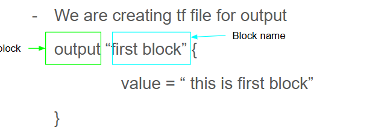

# What is Terraform?

Terraform is an open-source Infrastructure as Code (IaC) tool developed by HashiCorp.
It allows you to define, provision, and manage infrastructure across multiple cloud providers (AWS, GCP, Azure)
and on-prem environments using code.
Uses HCL (HashiCorp Configuration Language) to describe resources, dependencies, and configurations.

## Key Features:
Declarative syntax: You declare what you want, Terraform figures out how to create it.
Multi-cloud: Supports AWS, GCP, Azure, Kubernetes, etc.
Infrastructure lifecycle: Plan, apply, destroy, and update resources consistently.
State management: Tracks the current state of your infrastructure to apply only the necessary changes.

# When to Use Terraform?

## Use Terraform when you want to:
* Provision cloud infrastructure programmatically:
    Create servers, databases, networking, storage, etc.
* Manage infrastructure consistently across environments:
    Dev, QA, Staging, Production.
* Enable Infrastructure as Code (IaC):
    Version control your infrastructure like application code.
* Automate deployments and scaling:
    Avoid manual setup of resources; reduce human error.
* Work with multiple providers simultaneously:
    Example: AWS for compute, GCP for storage, Kubernetes for container orchestration.

# 1 how to create terraform configuration file

Inside that folder, create a file: demo.tf
see the output by execute `terraform plan` or `terraform apply` in PWD

# 2 Pass variable by default by variable.tf 

We can pass variable value in variable.tf
var.name pulls the value of the variable defined in variables.tf.
output block in demo.tf is used to display values back to the user after running terraform apply or plan.

## We can pass list of variable 
We can pass list of string or numbers and collect as per requirement with index position

# 3 Function use in terraform

Most commonly used Terraform functions (like concat, length, contains, lookup)
Dynamic Lookup Function use in terraform

# 4 How to read variable from environment

We can pass variables from the environment using the prefix TF_VAR_.
## Linux / Mac
export TF_VAR_username=Dushyant

## Windows PowerShell
$env:TF_VAR_username="Dushyant"
